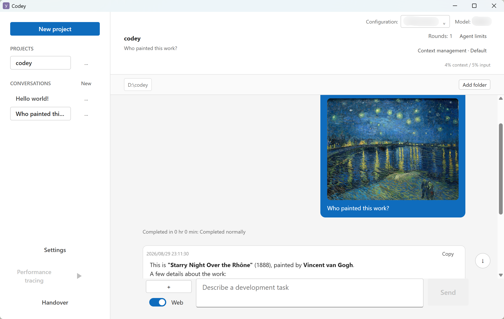
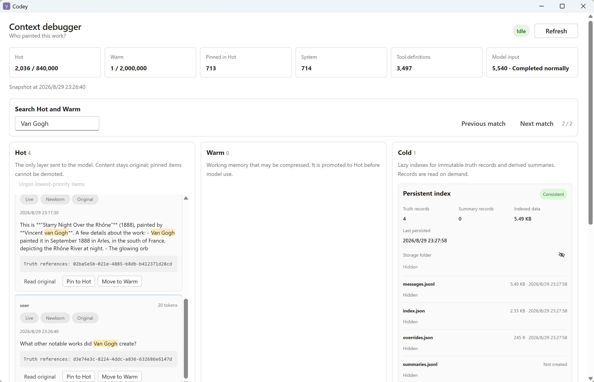
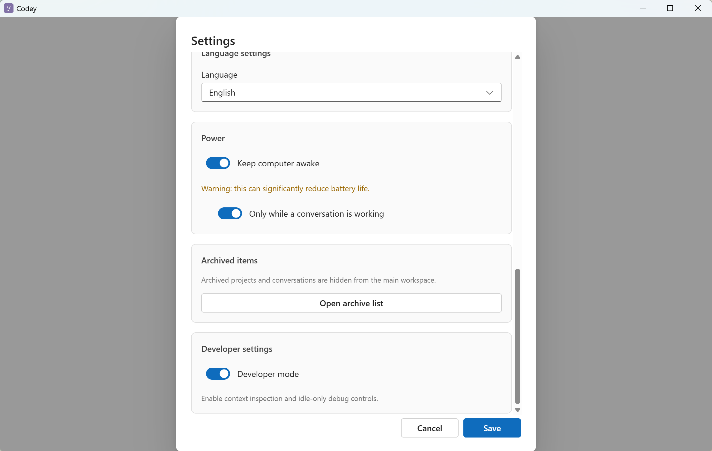
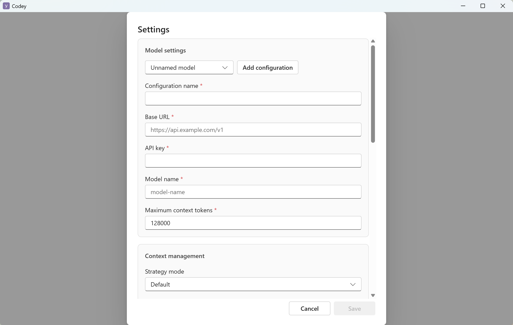
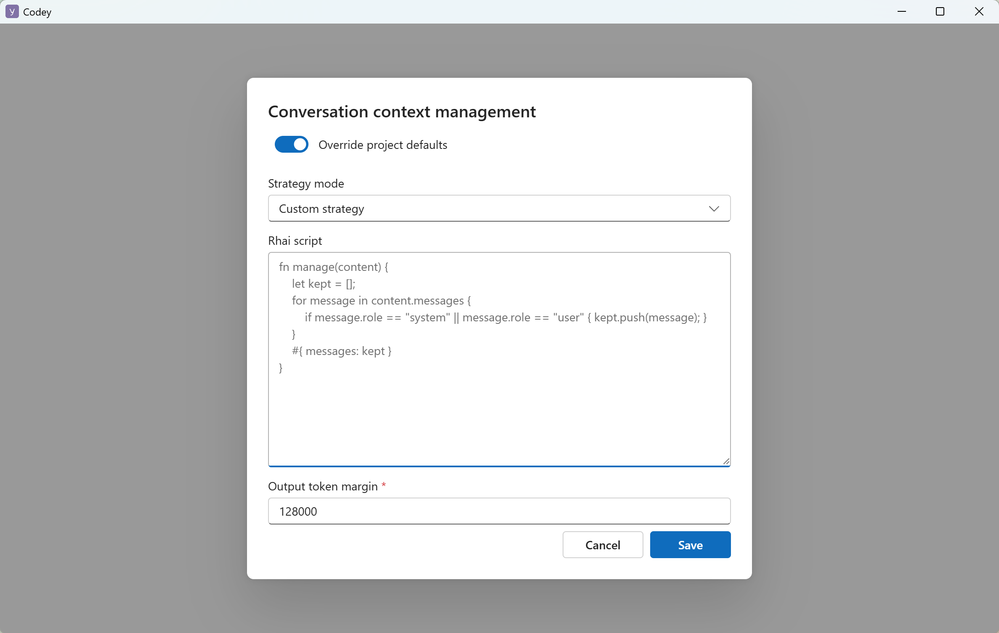

# codey

An open, functional desktop agent app for conversation, work and coding.  


## Highlights

### Multimodal Capabilities (Image Input) and Web‑Search Agent Tools



<small>The uploaded image in the demo above is sourced from: <a target="_blank" href="https://commons.wikimedia.org/wiki/File:Starry_Night_Over_the_Rhone.jpg">commons.wikimedia.org/wiki/File:Starry_Night_Over_the_Rhone.jpg</a>. Per the statement on the linked page, this image is in the public‑domain and is used in this project for demonstration purposes.</small>

### Layered Context‑Management Strategy and Context Debugger



### Agent Keeps Running Even When the Device Is Asleep



### Freedom to Choose Model Providers and Models



### Write Your Preferred Context‑Management Strategies in Rhai



## Development

```bash
pnpm install
pnpm dev
```

## Build

```bash
pnpm build
```

## Packaging

```bash
pnpm dist
```

Build artifacts are written to `dist/`.


## Public deployment

Use the Compose deployment package in [docker/README.md](docker/README.md).
